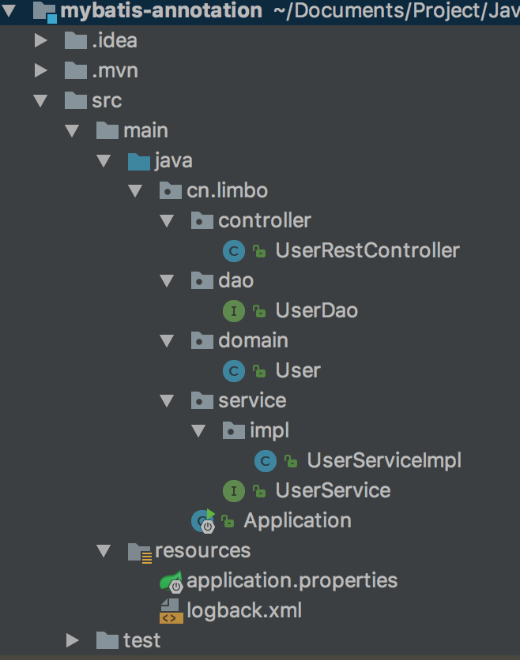

# Springboot 使用MyBatis注解

项目结构



对的，使用注解配置的话是不会出现mapper.xml的

mapper会移到UserDao中使用注解实现

UserDao.java

```Java
package cn.limbo.dao;

import cn.limbo.domain.User;
import org.apache.ibatis.annotations.*;

import java.util.List;

/**
 * Created by limbo on 2017/5/25.
 */

@Mapper  //标志为Mybatis的Mapper
public interface UserDao {


   /**
    * 根据用户名字查询用户信息
    * @param userName  用户名
    * @return
    */
   @Select("SELECT * FROM user WHERE user_name = #{userName}")
   @Results({
         @Result(property = "id", column = "id"),
         @Result(property = "name", column = "user_name"),
         @Result(property = "description", column = "description")
   })
   User findByName(@Param("userName") String userName);

   /**
    * 查找全部的User
    * @return
    */
   @Select("SELECT * FROM user")
   @Results({
         @Result(property = "id", column = "id"),
         @Result(property = "name", column = "user_name"),
         @Result(property = "description", column = "description")
   })
   List<User> findAll();

}
```

这里提醒两个地方，第一个Select注解中的SQL语句表示根据名字获取信息，#{}所填写的是下面Param里面的内容，还有，这个地方容易出现一个错误就是TooManyResultsException，这个表示你执行这个SQL语句返回的结果不止一条，但是你的方法的返回值只能有一个。深层次的原因是，如果你的返回值是一个单实体，Mybatis底层使用的是SelectOne，而如果返回值是List的话，就会使用SelectList方法，一个表示只返回一个，一个表示返回一堆，自己斟酌一下吧

第二个Results注解，表示你注入的实体的属性，需要注意不要写错了，property表示实体的属性，column表示数据库表中的字段

主要说的就是这个Mapper，其他的东西都是老套路