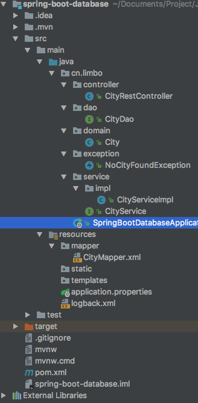
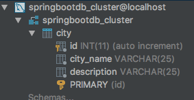

# SpringBoot整合mybatis

### pom添加Mybatis与mysql依赖

```xml
<properties>
        <mybatis-spring-boot>1.3.0</mybatis-spring-boot>
        <mysql-connector>5.1.39</mysql-connector>
</properties>
<!-- Spring Boot Mybatis 依赖 -->
<dependency>
        <groupId>org.mybatis.spring.boot</groupId>
        <artifactId>mybatis-spring-boot-starter</artifactId>
        <version>${mybatis-spring-boot}</version>
</dependency>

<!-- MySQL 连接驱动依赖 -->
<dependency>
        <groupId>mysql</groupId>
        <artifactId>mysql-connector-java</artifactId>
        <version>${mysql-connector}</version>
</dependency>
```

整个工程的pom文件

```xml
<?xml version="1.0" encoding="UTF-8"?>
<project xmlns="http://maven.apache.org/POM/4.0.0" xmlns:xsi="http://www.w3.org/2001/XMLSchema-instance"
   xsi:schemaLocation="http://maven.apache.org/POM/4.0.0 http://maven.apache.org/xsd/maven-4.0.0.xsd">
   <modelVersion>4.0.0</modelVersion>

   <groupId>cn.limbo</groupId>
   <artifactId>spring-boot-database</artifactId>
   <version>0.0.1-SNAPSHOT</version>
   <packaging>jar</packaging>

   <name>spring-boot-database</name>
   <description>Demo project for Spring Boot</description>

   <parent>
      <groupId>org.springframework.boot</groupId>
      <artifactId>spring-boot-starter-parent</artifactId>
      <version>1.5.2.RELEASE</version>
      <relativePath/> <!-- lookup parent from repository -->
   </parent>

   <properties>
      <project.build.sourceEncoding>UTF-8</project.build.sourceEncoding>
      <project.reporting.outputEncoding>UTF-8</project.reporting.outputEncoding>
      <java.version>1.8</java.version>
      <mybatis-spring-boot>1.3.0</mybatis-spring-boot>
      <mysql-connector>5.1.39</mysql-connector>
   </properties>

   <dependencies>
      <dependency>
         <groupId>org.springframework.boot</groupId>
         <artifactId>spring-boot-starter-web</artifactId>
      </dependency>

      <dependency>
         <groupId>org.springframework.boot</groupId>
         <artifactId>spring-boot-starter-test</artifactId>
         <scope>test</scope>
      </dependency>

      <!-- Spring Boot Mybatis 依赖 -->
      <dependency>
         <groupId>org.mybatis.spring.boot</groupId>
         <artifactId>mybatis-spring-boot-starter</artifactId>
         <version>${mybatis-spring-boot}</version>
      </dependency>

      <!-- MySQL 连接驱动依赖 -->
      <dependency>
         <groupId>mysql</groupId>
         <artifactId>mysql-connector-java</artifactId>
         <version>${mysql-connector}</version>
      </dependency>
   </dependencies>

   <build>
      <plugins>
         <plugin>
            <groupId>org.springframework.boot</groupId>
            <artifactId>spring-boot-maven-plugin</artifactId>
         </plugin>
      </plugins>
   </build>


</project>
```

### 修改application.properties

*添加数据库和Mybatis的配置*

```properties
## 数据源配置
spring.datasource.url=jdbc:mysql://localhost:3306/springbootdb_cluster?autoReconnect=true&useUnicode=true&characterEncoding=utf8
spring.datasource.username=root
spring.datasource.password=123456
spring.datasource.driver-class-name=com.mysql.jdbc.Driver

## Mybatis 配置
mybatis.typeAliasesPackage=cn.limbo.domain
mybatis.mapperLocations=classpath:mapper/*.xml
```

mybatis.typeAliasesPackage 配置为 cn.limbo.domain，指向实体类包路径。mybatis.mapperLocations 配置为 classpath 路径下 mapper 包下，* 代表会扫描所有 xml 文件。

mybatis 其他配置相关详解如下

> mybatis.config = mybatis 配置文件名称
>
> mybatis.mapperLocations = mapper xml 文件地址
>
> mybatis.typeAliasesPackage = 实体类包路径
>
> mybatis.typeHandlersPackage = type handlers 处理器包路径
>
> mybatis.check-config-location = 检查 mybatis 配置是否存在，一般命名为 mybatis-config.xml
>
> mybatis.executorType = 执行模式。默认是 SIMPLE

### 在 Application 应用启动类添加注解 MapperScan

```java
@SpringBootApplication
//mapper 接口扫描包
@MapperScan("cn.limbo.dao")
@ComponentScan
@EnableAutoConfiguration
public class SpringBootDatabaseApplication {

   public static void main(String[] args) {
      SpringApplication.run(SpringBootDatabaseApplication.class, args);
   }
}
```

mapper 接口类扫描包配置注解 MapperScan ：用这个注解可以注册 Mybatis mapper 接口类。

整个项目的目录结构如下：



表结构如下：



为了程序的健壮心，我还做了简单的异常处理，以及使用slf4j打印sql日志

具体的注解代码看工程吧。

## 坑点

1. 我想说一下关于Mybatis取数据的问题 — mybatis查询不到数据，而直接执行SQL可以执行：

   涉及到中文字符的东西，需要在数据库地址后面添加?autoReconnect=true&useUnicode=true&characterEncoding=utf8，否则很容易找不到东西