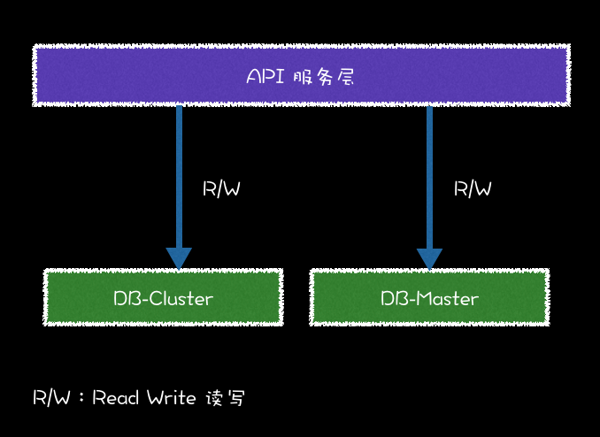
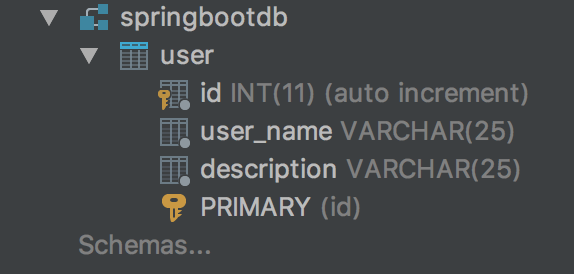
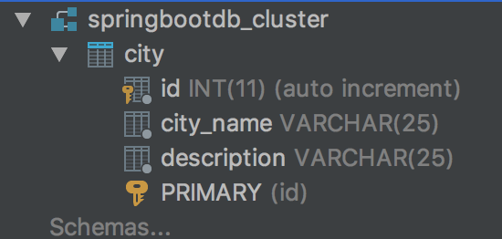
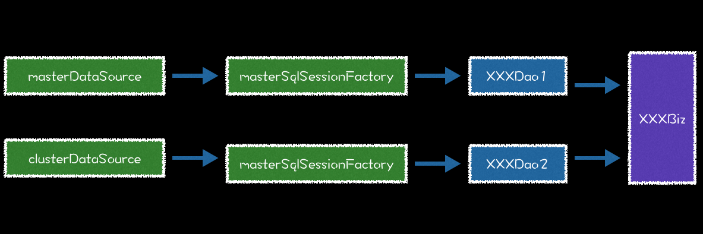

# Spring Boot 整合 Mybatis 实现 Druid 多数据源

### 一、多数据源的应用场景

目前，业界流行的数据操作框架是 Mybatis，那 Druid 是什么呢？
Druid 是 Java 的数据库连接池组件。Druid 能够提供强大的监控和扩展功能。比如可以监控 SQL ，在监控业务可以查询慢查询 SQL 列表等。Druid 核心主要包括三部分：

1. DruidDriver 代理 Driver，能够提供基于 Filter－Chain 模式的插件体系。
2. DruidDataSource 高效可管理的数据库连接池
3. SQLParser

当业务数据量达到了一定程度，DBA 需要合理配置数据库资源。即配置主库的机器高配置，把核心高频的数据放在主库上；把次要的数据放在从库，低配置。开源节流嘛，就这个意思。把数据放在不同的数据库里，就需要通过不同的数据源进行操作数据。这里我们举个 springboot-mybatis-mutil-datasource 工程案例：
user 用户表在主库 master 上，地址表 city 在从库 cluster 上。下面实现获取 根据用户名获取用户信息，包括从库的地址信息 REST API，那么需要从主库和从库中分别获取数据，并在业务逻辑层组装返回。逻辑如图：



表结构





### 二、 springboot-mybatis-mutil-datasource 工程案例

首先代码工程结构如下：
org.spring.springboot.config.ds 包包含了多数据源的配置，同样有第三个数据源，按照前几个复制即可
resources/mapper 下面有两个模块，分别是 Mybatis 不同数据源需要扫描的 mapper xml 目录

```
├── pom.xml
└── src
    └── main
        ├── java
        │   └── cn
        │       └── limbo
        │           ├── Application.java
        │               ├── config
        │               │   └── ds
        │               │       ├── ClusterDataSourceConfig.java
        │               │       └── MasterDataSourceConfig.java
        │               ├── controller
        │               │   └── UserRestController.java
        │               ├── dao
        │               │   ├── cluster
        │               │   │   └── CityDao.java
        │               │   └── master
        │               │       └── UserDao.java
        │               ├── domain
        │               │   ├── City.java
        │               │   └── User.java
        │               └── service
        │                   ├── UserService.java
        │                   └── impl
        │                       └── UserServiceImpl.java
        └── resources
            ├── application.properties
            └── mapper
                ├── cluster
                │   └── CityMapper.xml
                └── master
                    └── UserMapper.xml

```

1. **pom.xml**

```Xml
<?xml version="1.0" encoding="UTF-8"?>
<project xmlns="http://maven.apache.org/POM/4.0.0" xmlns:xsi="http://www.w3.org/2001/XMLSchema-instance"
	xsi:schemaLocation="http://maven.apache.org/POM/4.0.0 http://maven.apache.org/xsd/maven-4.0.0.xsd">
	<modelVersion>4.0.0</modelVersion>

	<groupId>cn.limbo</groupId>
	<artifactId>springboot-mybatis-mutil-datasource</artifactId>
	<version>0.0.1-SNAPSHOT</version>
	<packaging>jar</packaging>

	<name>springboot-mybatis-mutil-datasource</name>
	<description>Demo project for Spring Boot</description>

	<parent>
		<groupId>org.springframework.boot</groupId>
		<artifactId>spring-boot-starter-parent</artifactId>
		<version>1.5.2.RELEASE</version>
		<relativePath/> <!-- lookup parent from repository -->
	</parent>

	<properties>
		<project.build.sourceEncoding>UTF-8</project.build.sourceEncoding>
		<project.reporting.outputEncoding>UTF-8</project.reporting.outputEncoding>
		<java.version>1.8</java.version>
		<mybatis-spring-boot>1.3.0</mybatis-spring-boot>
		<mysql-connector>5.1.39</mysql-connector>
		<druid>1.0.18</druid>
	</properties>

	<dependencies>
		<dependency>
			<groupId>org.springframework.boot</groupId>
			<artifactId>spring-boot-starter-web</artifactId>
		</dependency>

		<dependency>
			<groupId>org.springframework.boot</groupId>
			<artifactId>spring-boot-starter-test</artifactId>
			<scope>test</scope>
		</dependency>
		<!-- Spring Boot Mybatis 依赖 -->
		<dependency>
			<groupId>org.mybatis.spring.boot</groupId>
			<artifactId>mybatis-spring-boot-starter</artifactId>
			<version>${mybatis-spring-boot}</version>
		</dependency>

		<!-- MySQL 连接驱动依赖 -->
		<dependency>
			<groupId>mysql</groupId>
			<artifactId>mysql-connector-java</artifactId>
			<version>${mysql-connector}</version>
		</dependency>

		<!-- Druid 数据连接池依赖 -->
		<dependency>
			<groupId>com.alibaba</groupId>
			<artifactId>druid</artifactId>
			<version>${druid}</version>
		</dependency>
	</dependencies>

	<build>
		<plugins>
			<plugin>
				<groupId>org.springframework.boot</groupId>
				<artifactId>spring-boot-maven-plugin</artifactId>
			</plugin>
		</plugins>
	</build>


</project>

```

2. **application.properties 配置两个数据源**

```properties
## master 数据源配置
master.datasource.url=jdbc:mysql://localhost:3306/springbootdb?autoReconnect=true&useUnicode=true&characterEncoding=utf8
master.datasource.username=root
master.datasource.password=123456
master.datasource.driverClassName=com.mysql.jdbc.Driver

## cluster 数据源配置
cluster.datasource.url=jdbc:mysql://localhost:3306/springbootdb_cluster?autoReconnect=true&useUnicode=true&characterEncoding=utf8
cluster.datasource.username=root
cluster.datasource.password=123456
cluster.datasource.driverClassName=com.mysql.jdbc.Driver
```

3.**数据源配置**

多数据源配置的时候注意，必须要有一个主数据源，即 MasterDataSourceConfig 配置：

```Java
@Configuration
// 扫描 Mapper 接口并容器管理
@MapperScan(basePackages = MasterDataSourceConfig.PACKAGE, sqlSessionFactoryRef = "masterSqlSessionFactory")
public class MasterDataSourceConfig {
 
    // 精确到 master 目录，以便跟其他数据源隔离
    static final String PACKAGE = "org.spring.springboot.dao.master";
    static final String MAPPER_LOCATION = "classpath:mapper/master/*.xml";
 
    @Value("${master.datasource.url}")
    private String url;
 
    @Value("${master.datasource.username}")
    private String user;
 
    @Value("${master.datasource.password}")
    private String password;
 
    @Value("${master.datasource.driverClassName}")
    private String driverClass;
 
    @Bean(name = "masterDataSource")
    @Primary
    public DataSource masterDataSource() {
        DruidDataSource dataSource = new DruidDataSource();
        dataSource.setDriverClassName(driverClass);
        dataSource.setUrl(url);
        dataSource.setUsername(user);
        dataSource.setPassword(password);
        return dataSource;
    }
 
    @Bean(name = "masterTransactionManager")
    @Primary
    public DataSourceTransactionManager masterTransactionManager() {
        return new DataSourceTransactionManager(masterDataSource());
    }
 
    @Bean(name = "masterSqlSessionFactory")
    @Primary
    public SqlSessionFactory masterSqlSessionFactory(@Qualifier("masterDataSource") DataSource masterDataSource)
            throws Exception {
        final SqlSessionFactoryBean sessionFactory = new SqlSessionFactoryBean();
        sessionFactory.setDataSource(masterDataSource);
        sessionFactory.setMapperLocations(new PathMatchingResourcePatternResolver()
                .getResources(MasterDataSourceConfig.MAPPER_LOCATION));
        return sessionFactory.getObject();
    }
}

```

@Primary 标志这个 Bean 如果在多个同类 Bean 候选时，该 Bean 优先被考虑。「多数据源配置的时候注意，必须要有一个主数据源，用 @Primary 标志该 Bean」
@MapperScan 扫描 Mapper 接口并容器管理，包路径精确到 master，为了和下面 cluster 数据源做到精确区分
@Value 获取全局配置文件 application.properties 的 kv 配置,并自动装配
sqlSessionFactoryRef 表示定义了 key ，表示一个唯一 SqlSessionFactory 实例

同理可得，从数据源 ClusterDataSourceConfig 配置如下：

```Java
@Configuration
// 扫描 Mapper 接口并容器管理
@MapperScan(basePackages = ClusterDataSourceConfig.PACKAGE, sqlSessionFactoryRef = "clusterSqlSessionFactory")
public class ClusterDataSourceConfig {
 
    // 精确到 cluster 目录，以便跟其他数据源隔离
    static final String PACKAGE = "org.spring.springboot.dao.cluster";
    static final String MAPPER_LOCATION = "classpath:mapper/cluster/*.xml";
 
    @Value("${cluster.datasource.url}")
    private String url;
 
    @Value("${cluster.datasource.username}")
    private String user;
 
    @Value("${cluster.datasource.password}")
    private String password;
 
    @Value("${cluster.datasource.driverClassName}")
    private String driverClass;
 
    @Bean(name = "clusterDataSource")
    public DataSource clusterDataSource() {
        DruidDataSource dataSource = new DruidDataSource();
        dataSource.setDriverClassName(driverClass);
        dataSource.setUrl(url);
        dataSource.setUsername(user);
        dataSource.setPassword(password);
        return dataSource;
    }
 
    @Bean(name = "clusterTransactionManager")
    public DataSourceTransactionManager clusterTransactionManager() {
        return new DataSourceTransactionManager(clusterDataSource());
    }
 
    @Bean(name = "clusterSqlSessionFactory")
    public SqlSessionFactory clusterSqlSessionFactory(@Qualifier("clusterDataSource") DataSource clusterDataSource)
            throws Exception {
        final SqlSessionFactoryBean sessionFactory = new SqlSessionFactoryBean();
        sessionFactory.setDataSource(clusterDataSource);
        sessionFactory.setMapperLocations(new PathMatchingResourcePatternResolver()
                .getResources(ClusterDataSourceConfig.MAPPER_LOCATION));
        return sessionFactory.getObject();
    }
}
```

上面数据配置分别扫描 Mapper 接口，cn.limbo.dao.master（对应 xml classpath:mapper/master ） 和 cn.limbo.dao.cluster（对应 xml classpath:mapper/cluster ） 包中对应的 UserDAO 和 CityDAO 。
都有 @Mapper 标志为 Mybatis 的并通过容器管理的 Bean。Mybatis 内部会使用反射机制运行去解析相应 SQL。

其他具体的代码请看工程

4. **启动**

   现在启动application，地址栏输入localhost:8080/api/user，看到有具体的信息即可

### 三、小结

多数据源适合的场景很多。不同的 DataSource ，不同的 SqlSessionFactory 和 不同的 DAO 层，在业务逻辑层做 整合。总结的架构图如下：



