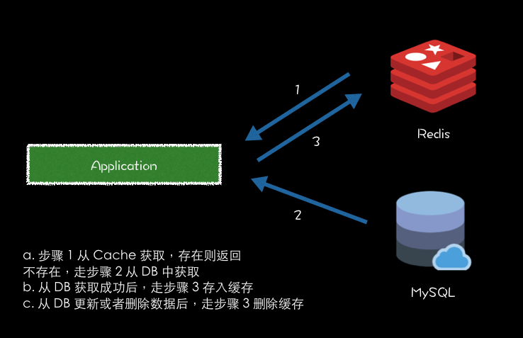
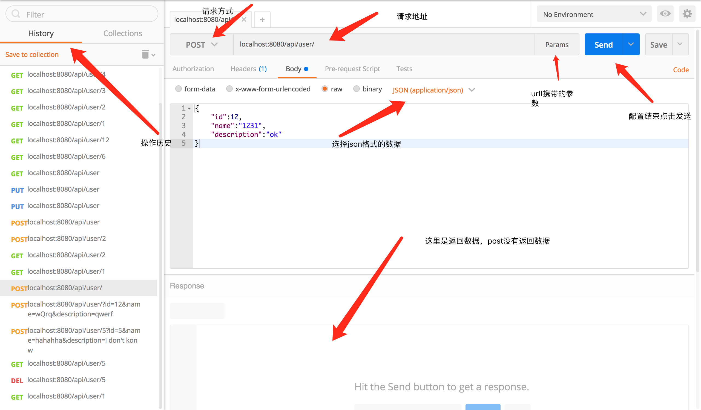

# Spring Boot 整合 Redis 实现缓存操作

### **一、缓存的应用场景**

**什么是缓存？**

在互联网场景下，尤其 2C 端大流量场景下，需要将一些经常展现和不会频繁变更的数据，存放在存取速率更快的地方。缓存就是一个存储器，在技术选型中，常用 Redis 作为缓存数据库。缓存主要是在获取资源方便性能优化的关键方面。

Redis 是一个高性能的 key-value 数据库。GitHub 地址：[https://github.com/antirez/redis](https://github.com/antirez/redis) 。Github 是这么描述的：

Redis is an in-memory database that persists on disk. The data model is key-value, but many different kind of values are supported: Strings, Lists, Sets, Sorted Sets, Hashes, HyperLogLogs, Bitmaps.

**缓存的应用场景有哪些呢？**

比如常见的电商场景，根据商品 ID 获取商品信息时，店铺信息和商品详情信息就可以缓存在 Redis，直接从 Redis 获取。减少了去数据库查询的次数。但会出现新的问题，就是如何对缓存进行更新？这就是下面要讲的。

### 二、更新缓存的策略

参考《缓存更新的套路》[http://coolshell.cn/articles/17416.html](http://coolshell.cn/articles/17416.html)，缓存更新的模式有四种：Cache aside, Read through, Write through, Write behind caching。

这里我们使用的是 Cache Aside 策略，从三个维度：（摘自 耗子叔叔博客）

失效：应用程序先从cache取数据，没有得到，则从数据库中取数据，成功后，放到缓存中。

命中：应用程序从cache中取数据，取到后返回。

更新：先把数据存到数据库中，成功后，再让缓存失效。

**大致流程**如下：

获取商品详情举例

a. 从商品 Cache 中获取商品详情，如果存在，则返回获取 Cache 数据返回。

b. 如果不存在，则从商品 DB 中获取。获取成功后，将数据存到 Cache 中。则下次获取商品详情，就可以从 Cache 就可以得到商品详情数据。

c. 从商品 DB 中更新或者删除商品详情成功后，则从缓存中删除对应商品的详情缓存



## 使用redisTemplate实现

1. 创建数据库，数据库的结构如下：

   

2. 插入一定量的数据，并开启redis的服务端

3. 创建一个springboot的工程

4. 具体代码可以参考工程目录了，这里不再赘述

5. 测试工程。这里我用了chrome的一个插件，叫做postman，很不错的一个测试工具：

   

   用法也很简单，用户界面很友好：

   

### 注意点

1. domain 对象 User 必须实现序列化，因为需要将对象序列化后存储到 Redis。如果没实现 Serializable ，控制台会爆出以下异常：

   ```Shell
   Serializable
   java.lang.IllegalArgumentException: DefaultSerializer requires a Serializable payload but received an object of type

   ```

2. 如果需要自定义序列化实现，只要实现 RedisSerializer 接口去实现即可，然后在使用 RedisTemplate.setValueSerializer 方法去设置你实现的序列化实现。

3. 首先这里注入了 RedisTemplate 对象。联想到 Spring 的 JdbcTemplate ，RedisTemplate 封装了 RedisConnection，具有连接管理，序列化和 Redis 操作等功能。还有针对 String 的支持对象 StringRedisTemplate。

4. Redis 操作视图接口类用的是 ValueOperations，对应的是 Redis String/Value 操作。还有其他的操作视图，ListOperations、SetOperations、ZSetOperations 和 HashOperations 。ValueOperations 插入缓存是可以设置失效时间，这里设置的失效时间是 10 m。

##实现Cache接口实现

