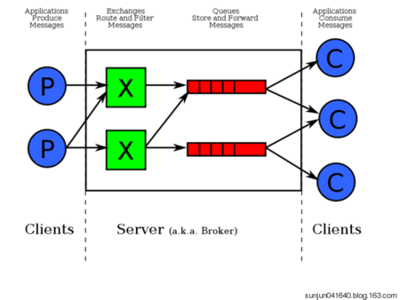
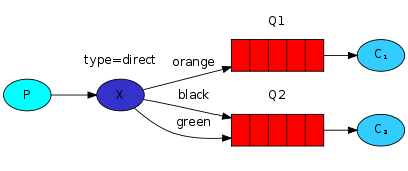

# Spring Boot 整合RabbitMQ

RabbitMQ 即一个消息队列，主要是用来实现应用程序的异步和解耦，同时也能起到消息缓冲，消息分发的作用。

消息中间件在互联网公司的使用中越来越多，刚才还看到新闻阿里将RocketMQ捐献给了apache，当然了今天的主角还是讲RabbitMQ。消息中间件最主要的作用是解耦，中间件最标准的用法是生产者生产消息传送到队列，消费者从队列中拿取消息并处理，生产者不用关心是谁来消费，消费者不用关心谁在生产消息，从而达到解耦的目的。在分布式的系统中，消息队列也会被用在很多其它的方面，比如：分布式事务的支持，RPC的调用等等。

以前一直使用的是ActiveMQ，在实际的生产使用中也出现了一些小问题，在网络查阅了很多的资料后，决定尝试使用RabbitMQ来替换ActiveMQ，RabbitMQ的高可用性、高性能、灵活性等一些特点吸引了我们，查阅了一些资料整理出此文。

## **RabbitMQ介绍**

RabbitMQ是实现AMQP（高级消息队列协议）的消息中间件的一种，最初起源于金融系统，用于在分布式系统中存储转发消息，在易用性、扩展性、高可用性等方面表现不俗。RabbitMQ主要是为了实现系统之间的双向解耦而实现的。当生产者大量产生数据时，消费者无法快速消费，那么需要一个中间层。保存这个数据。

AMQP，即Advanced Message Queuing Protocol，高级消息队列协议，是应用层协议的一个开放标准，为面向消息的中间件设计。消息中间件主要用于组件之间的解耦，消息的发送者无需知道消息使用者的存在，反之亦然。AMQP的主要特征是面向消息、队列、路由（包括点对点和发布/订阅）、可靠性、安全。

RabbitMQ是一个开源的AMQP实现，服务器端用Erlang语言编写，支持多种客户端，如：Python、Ruby、.NET、Java、JMS、C、PHP、ActionScript、XMPP、STOMP等，支持AJAX。用于在分布式系统中存储转发消息，在易用性、扩展性、高可用性等方面表现不俗。

- **相关概念**

通常我们谈到队列服务, 会有三个概念： 发消息者、队列、收消息者，RabbitMQ 在这个基本概念之上, 多做了一层抽象, 在发消息者和 队列之间, 加入了交换器 (Exchange). 这样发消息者和队列就没有直接联系, 转而变成发消息者把消息给交换器, 交换器根据调度策略再把消息再给队列。



- - 左侧 P 代表 生产者，也就是往 RabbitMQ 发消息的程序。
  - 中间即是 RabbitMQ，*其中包括了 交换机 和 队列。*
  - 右侧 C 代表 消费者，也就是往 RabbitMQ 拿消息的程序。

那么，*其中比较重要的概念有 4 个，分别为：虚拟主机，交换机，队列，和绑定。*

- - 虚拟主机：一个虚拟主机持有一组交换机、队列和绑定。为什么需要多个虚拟主机呢？很简单，RabbitMQ当中，*用户只能在虚拟主机的粒度进行权限控制。* 因此，如果需要禁止A组访问B组的交换机/队列/绑定，必须为A和B分别创建一个虚拟主机。每一个RabbitMQ服务器都有一个默认的虚拟主机“/”。
  - 交换机：*Exchange 用于转发消息，但是它不会做存储* ，如果没有 Queue bind 到 Exchange 的话，它会直接丢弃掉 Producer 发送过来的消息。 这里有一个比较重要的概念：路由键 。消息到交换机的时候，交互机会转发到对应的队列中，那么究竟转发到哪个队列，就要根据该路由键。
  - 绑定：也就是交换机需要和队列相绑定，这其中如上图所示，是多对多的关系。

- **交换机(Exchange)**

交换机的功能主要是接收消息并且转发到绑定的队列，交换机不存储消息，在启用ack模式后，交换机找不到队列会返回错误。交换机有四种类型：Direct, topic, Headers and Fanout

- - Direct：direct 类型的行为是”先匹配, 再投送”. 即在绑定时设定一个 **routing_key**, 消息的 **routing_key** 匹配时, 才会被交换器投送到绑定的队列中去.
  - Topic：按规则转发消息（最灵活）
  - Headers：设置header attribute参数类型的交换机
  - Fanout：转发消息到所有绑定队列

- **Direct Exchange**

Direct Exchange是RabbitMQ默认的交换机模式，也是最简单的模式，根据key全文匹配去寻找队列。



第一个 X - Q1 就有一个 binding key，名字为 orange； X - Q2 就有 2 个 binding key，名字为 black 和 green。*当消息中的 路由键 和 这个 binding key 对应上的时候，那么就知道了该消息去到哪一个队列中。*

Ps：为什么 X 到 Q2 要有 black，green，2个 binding key呢，一个不就行了吗？ - 这个主要是因为可能又有 Q3，而Q3只接受 black 的信息，而Q2不仅接受black 的信息，还接受 green 的信息。

- **Topic Exchange**

*Topic Exchange 转发消息主要是根据通配符。* 在这种交换机下，队列和交换机的绑定会定义一种路由模式，那么，通配符就要在这种路由模式和路由键之间匹配后交换机才能转发消息。

在这种交换机模式下：

- - 路由键必须是一串字符，用句号（.） 隔开，比如说 agreements.us，或者 agreements.eu.stockholm 等。
  - 路由模式必须包含一个 星号（* )，主要用于匹配路由键指定位置的一个单词，比如说，一个路由模式是这样子：agreements..b.*，那么就只能匹配路由键是这样子的：第一个单词是 agreements，第四个单词是 b。 井号（#）就表示相当于一个或者多个单词，例如一个匹配模式是agreements.eu.berlin.#，那么，以agreements.eu.berlin开头的路由键都是可以的。

具体代码发送的时候还是一样，第一个参数表示交换机，第二个参数表示routing key，第三个参数即消息。如下：

```Java
rabbitTemplate.convertAndSend("testTopicExchange","key1.a.c.key2", " this is  RabbitMQ!");
```

topic 和 direct 类似, 只是匹配上支持了”模式”, 在”点分”的 routing_key 形式中, 可以使用两个通配符:

- - *** **表示一个词
  - **# **表示零个或多个词

- **Headers Exchange**

headers 也是根据规则匹配, 相较于 direct 和 topic 固定地使用 routing_key , headers 则是一个自定义匹配规则的类型. 在队列与交换器绑定时, 会设定一组键值对规则, 消息中也包括一组键值对( headers 属性), 当这些键值对有一对, 或全部匹配时, 消息被投送到对应队列.

- **Fanout Exchange**

Fanout Exchange 消息广播的模式，不管路由键或者是路由模式，*会把消息发给绑定给它的全部队列*，如果配置了routing_key会被忽略。

## RabbitMQ安装配置

## 先安装 Erlang

- 有 EPEL 源的情况（需要安装的内容较多，宽带要能跟上）：`sudo yum install erlang`
- RabbitMQ 官网提供 Erlang 安装包：
  - 下载地址：[http://www.rabbitmq.com/releases/erlang/](http://www.rabbitmq.com/releases/erlang/)
  - 下载好之后，安装下面两个文件：
    - `sudo yum localinstall -y esl-erlang_18.1-1~centos~6_amd64.rpm`
    - `sudo yum localinstall -y esl-erlang-compat-18.1-1.noarch.rpm`
- Mac下可以直接用brew安装

## 安装 RabbitMQ

- 此时（2016-04），最新版：**3.6.1**
- 安装：`rpm --import https://www.rabbitmq.com/rabbitmq-signing-key-public.asc`
- 安装：`sudo yum install -y rabbitmq-server-3.6.1-1.noarch.rpm`
- 启动服务：
  - 先看下自己的主机名：`hostname`，我的主机名是：**judasnHost2**
  - 先修改一下 host 文件：`vim /etc/hosts`，添加一行：`127.0.0.1 judasnHost2`（必须这样做）
  - 启动：`service rabbitmq-server start`，启动一般都比较慢，所以别急
  - 停止：`service rabbitmq-server stop`
  - 重启：`service rabbitmq-server restart`
  - 设置开机启动：`chkconfig rabbitmq-server on`
- Mac下可以直接用brew安装

## 配置

- 查找默认配置位置：`find / -name "rabbitmq.config.example"`，我这边搜索结果是：`/usr/share/doc/rabbitmq-server-3.6.1/rabbitmq.config.example`
- 复制默认配置：`cp /usr/share/doc/rabbitmq-server-3.6.1/rabbitmq.config.example /etc/rabbitmq/`
- 修改配置文件名：`cd /etc/rabbitmq ; mv rabbitmq.config.example rabbitmq.config`
- 编辑配置文件，开启用户远程访问：`vim rabbitmq.config`在 64 行，默认有这样一句话：`%% {loopback_users, []},`，注意，该语句最后有一个逗号，等下是要去掉的我们需要改为：`{loopback_users, []}`，
- 开启 Web 界面管理：`rabbitmq-plugins enable rabbitmq_management`
- 重启 RabbitMQ 服务：`service rabbitmq-server restart`
- 开放防火墙端口：
  - `sudo iptables -I INPUT -p tcp -m tcp --dport 15672 -j ACCEPT`
  - `sudo iptables -I INPUT -p tcp -m tcp --dport 5672 -j ACCEPT`
  - `sudo service iptables save`
  - `sudo service iptables restart`
- 浏览器访问：`http://192.168.1.114:15672` 默认管理员账号：**guest** 默认管理员密码：**guest**
- 添加新授权用户（如下图所示）：
  - [](https://github.com/judasn/Linux-Tutorial/blob/master/images/RabbitMQ-Add-User-a-1.jpg)
- 添加 Host（如下图所示）：
  - [](https://github.com/judasn/Linux-Tutorial/blob/master/images/RabbitMQ-Add-User-a-2.jpg)
- 给添加的 Host 设置权限（如下图所示）：
  - [](https://github.com/judasn/Linux-Tutorial/blob/master/images/RabbitMQ-Add-User-a-3.gif)
- 交换机绑定队列（如下图所示）：
  - [](https://github.com/judasn/Linux-Tutorial/blob/master/images/RabbitMQ-Bindings-Queue-a-1.gif)
- **Mac下的配置文件在/usr/local/etc/rabbitmq中，有一个rabbitmq-env.conf,这个文件中指定了配置文件的信息**

## **springboot集成RabbitMQ**

springboot集成RabbitMQ非常简单，如果只是简单的使用配置非常少，springboot提供了spring-boot-starter-amqp项目对消息各种支持。

- **简单使用**

1、配置pom包，主要是添加spring-boot-starter-amqp的支持

```Xml
<dependency>
		<groupId>org.springframework.boot</groupId>
		<artifactId>spring-boot-starter-amqp</artifactId>
</dependency>
```

2、配置文件

配置rabbitmq的安装地址、端口以及账户信息

```properties
#rabbitmq
spring.rabbitmq.host=localhost
spring.rabbitmq.port=5672
spring.rabbitmq.username=admin
spring.rabbitmq.password=123456
```

3、队列配置

```java
@Configuration
public class RabbitConfig {

    @Bean
    public Queue Queue() {
        return new Queue("hello");
    }

}
```

3、发送者

rabbitTemplate是springboot 提供的默认实现

```java
public class HelloSender {

	@Autowired
	private AmqpTemplate rabbitTemplate;

	public void send() {
		String context = "hello " + new Date();
		System.out.println("Sender : " + context);
		this.rabbitTemplate.convertAndSend("hello", context);
	}

}
```

4、接收者

```java
@Component
@RabbitListener(queues = "hello")
public class HelloReceiver {

    @RabbitHandler
    public void process(String hello) {
        System.out.println("Receiver  : " + hello);
    }

}
```

5、测试

```java
@RunWith(SpringRunner.class)
@SpringBootTest
public class RabbitMqHelloTest {

	@Autowired
	private HelloSender helloSender;

	@Test
	public void hello() throws Exception {
		helloSender.send();
	}

}
```

> 注意，发送者和接收者的queue name必须一致，不然不能接收

- **高级使用**

**对象的支持**

springboot以及完美的支持对象的发送和接收，不需要格外的配置。

```java
//发送者
public void send(User user) {
	System.out.println("Sender object: " + user.toString());
	this.rabbitTemplate.convertAndSend("object", user);
}

...

//接受者
@RabbitHandler
public void process(User user) {
    System.out.println("Receiver object : " + user);
}
```

结果如下：

```
Sender object: User{name='neo', pass='123456'}
Receiver object : User{name='neo', pass='123456'}

```

**Topic Exchange**

topic 是RabbitMQ中最灵活的一种方式，可以根据routing_key自由的绑定不同的队列

首先对topic规则配置，这里使用两个队列来测试

```java
@Configuration
public class TopicRabbitConfig {

	public final static String TOPIC_ONE = "topic.one";
	public final static String TOPIC_TWO = "topic.two";
	public final static String TOPIC_EXCHANGE = "topicExchange";

	@Bean
	public Queue queue_one(){
		return new Queue(TOPIC_ONE);
	}

	@Bean
	public Queue queue_two(){
		return new Queue(TOPIC_TWO);
	}

	@Bean
	TopicExchange exchange(){
		return new TopicExchange(TOPIC_EXCHANGE);
	}

	@Bean
	Binding bindingExchangeOne(Queue queue_one, TopicExchange exchange){
		return BindingBuilder.bind(queue_one).to(exchange).with("topic.one");
	}

	@Bean
	Binding bindingExchangeTwo(Queue queue_two, TopicExchange exchange){
		//# 表示零个或多个词
		//* 表示一个词
		return BindingBuilder.bind(queue_two).to(exchange).with("topic.#");
	}

}

```

使用queueMessages同时匹配两个队列，queueMessage只匹配”topic.message”队列

```java

@Component
public class TopicSender {

	@Autowired
	private AmqpTemplate rabbitTemplate;

	//两个消息接受者都可以收到
	public void send_one() {
		String context = "Hi, I am message one";
		System.out.println("Sender : " + context);
		this.rabbitTemplate.convertAndSend(TopicRabbitConfig.TOPIC_EXCHANGE,"topic.one",context);
	}


	//只有TopicReceiverTwo都可以收到
	public void send_two() {
		String context = "Hi, I am message two";
		System.out.println("Sender : " + context);
		this.rabbitTemplate.convertAndSend(TopicRabbitConfig.TOPIC_EXCHANGE,"topic.two",context);
	}

}

```

发送send1会匹配到topic.#和topic.message 两个Receiver都可以收到消息，发送send2只有topic.#可以匹配所有只有Receiver2监听到消息

**Fanout Exchange**

Fanout 就是我们熟悉的广播模式或者订阅模式，给Fanout交换机发送消息，绑定了这个交换机的所有队列都收到这个消息。

Fanout 相关配置

```Java
@Configuration
public class FanoutRabbitConfig {

    @Bean
    public Queue AMessage() {
        return new Queue("fanout.A");
    }

    @Bean
    public Queue BMessage() {
        return new Queue("fanout.B");
    }

    @Bean
    public Queue CMessage() {
        return new Queue("fanout.C");
    }

    @Bean
    FanoutExchange fanoutExchange() {
        return new FanoutExchange("fanoutExchange");
    }

    @Bean
    Binding bindingExchangeA(Queue AMessage,FanoutExchange fanoutExchange) {
        return BindingBuilder.bind(AMessage).to(fanoutExchange);
    }

    @Bean
    Binding bindingExchangeB(Queue BMessage, FanoutExchange fanoutExchange) {
        return BindingBuilder.bind(BMessage).to(fanoutExchange);
    }

    @Bean
    Binding bindingExchangeC(Queue CMessage, FanoutExchange fanoutExchange) {
        return BindingBuilder.bind(CMessage).to(fanoutExchange);
    }

}
```

这里使用了A、B、C三个队列绑定到Fanout交换机上面，发送端的routing_key写任何字符都会被忽略：

```Java
public void send() {
		String context = "hi, fanout msg ";
		System.out.println("Sender : " + context);
		this.rabbitTemplate.convertAndSend("fanoutExchange","", context);
}
```

结果如下：

```shell
Sender : hi, fanout msg 
...
fanout Receiver B: hi, fanout msg 
fanout Receiver A  : hi, fanout msg 
fanout Receiver C: hi, fanout msg 
```

结果说明，绑定到fanout交换机上面的队列都收到了消息

# 坑点

1. 新建用户了一定要给这个用户设置vhost的访问权限，刚开始就是因为这个原因导致一直出现Connection Refuse这样的错误，可以用命令行也可以用那个管理界面，推荐用命令行。
2. 使用对象传输的时候对象一定要实现Serializable接口，否则不能传输
3. 如果任何一个队列中出现了不能处理的消息，整个vhost就用不了了，所以建议把不同的queue和exchange放在不同的vhost下面，保证互不干扰。（我就是好奇一下，把User的那个Serializable给去掉了，然后就一直报错，后来发现是queue不能处理未序列化的对象导致listener失效导致的错误，因为这个导致一个vhost下的所有queue都不能用了，尴尬）。